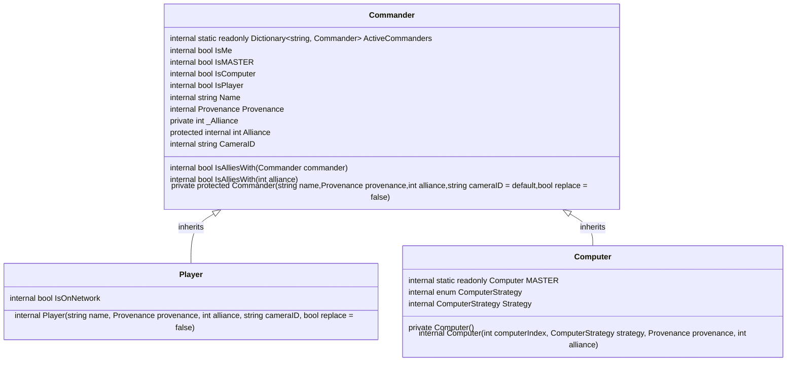

[<h1></h1>](https://github.com/Galacticai/Commanders/blob/dev/Assets/Scripts/Game/Commanders/Commander.cs)

`Commanders`>`Assets`>`Scripts`>`Game`>`Commanders`>**`Commander`**

---

```mermaid
classDiagram-v2
class Commander {
    internal static readonly Dictionary~string, Commander~ ActiveCommanders

    internal bool IsMe
    internal bool IsMASTER
    internal bool IsComputer
    internal bool IsPlayer
    internal bool IsAlliesWith(Commander commander)
    internal bool IsAlliesWith(int alliance)

    internal string Name
    internal Provenance Provenance
    private int _Alliance
    protected internal int Alliance
    internal string CameraID
    private protected Commander(string name,Provenance provenance,int alliance,string cameraID = default,bool replace = false)
}
    Commander <|-- Player : inherits
    class Player {
        internal bool IsOnNetwork
        internal Player(string name, Provenance provenance, int alliance, string cameraID, bool replace = false)
    }
    Commander <|-- Computer : inherits
    class Computer {
        internal static readonly Computer MASTER
        internal enum ComputerStrategy
        internal ComputerStrategy Strategy

        private Computer()
        internal Computer(int computerIndex, ComputerStrategy strategy, Provenance provenance, int alliance)
    }
```