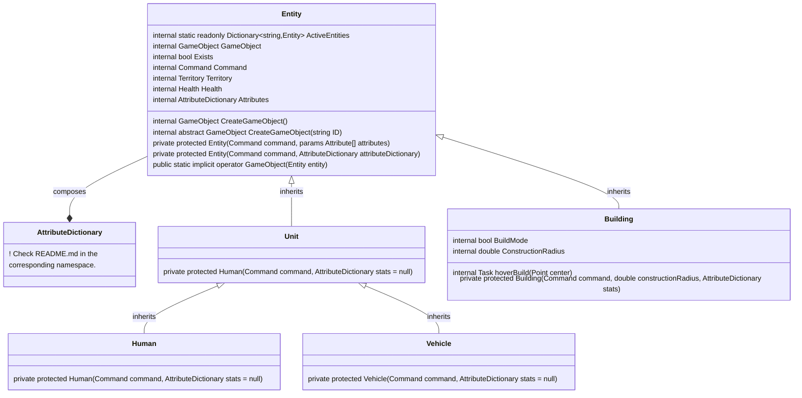


 

`Commanders`>`Assets`>`Scripts`>`Game`>`Entities`>**{`Entity`}**

---

```mermaid
classDiagram-v2
    class Entity {
        internal static readonly Dictionary~string,Entity~ ActiveEntities
        internal GameObject GameObject
        internal bool Exists
        internal Command Command
        internal Territory Territory
        internal Health Health
        
        internal GameObject CreateGameObject()
        internal abstract GameObject CreateGameObject(string ID)

        internal AttributeDictionary Attributes

        private protected Entity(Command command, params Attribute[] attributes)
        private protected Entity(Command command, AttributeDictionary attributeDictionary)

        public static implicit operator GameObject(Entity entity)
    }
    Entity --* AttributeDictionary : composes
        class AttributeDictionary {
            ! Check README.md in the
            corresponding namespace.
        }
    Entity <|-- Unit : inherits
        class Unit {
            private protected Human(Command command, AttributeDictionary stats = null)
        }
        Unit <|-- Human : inherits
            class Human {
                private protected Human(Command command, AttributeDictionary stats = null)
            }
        Unit <|-- Vehicle : inherits
            class Vehicle {
                private protected Vehicle(Command command, AttributeDictionary stats = null)
            }
    Entity <|-- Building : inherits
        class Building {
            internal bool BuildMode
            internal Task<bool> hoverBuild(Point center)
            internal double ConstructionRadius
            private protected Building(Command command, double constructionRadius, AttributeDictionary stats)
        }

```